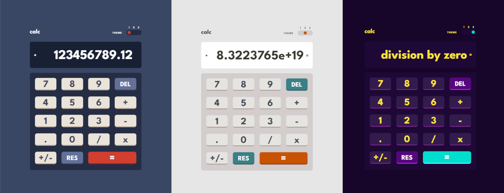
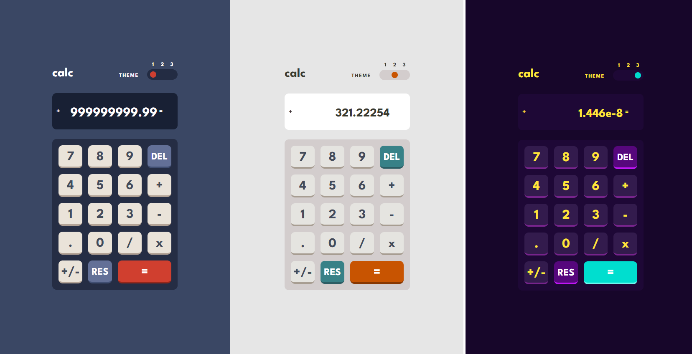

    <h1>Calculator With Themes</h1>
    <h3>
        <a href="https://chrisonoo.github.io/CalculatorWithThemes/">
            Live demo
        </a>
         | 
        <a href="https://github.com/chrisonoo/CalculatorWithThemes">
            GitHub
        </a>
    </h3>
    
A simple calculator with three color themes

    
<b>Status:</b> Project completed

     
    
Technologies and tools:

    

        
        
        
        
        
        
        
    

 

## Description

A basic calculator implementing four mathematical functions with three color themes, allowing for multiple operations until pressing equals.

Features and implementations include:

1. Performs addition, subtraction, multiplication, and division.
2. Operations on both positive and negative numbers.
3. Handling of divide by zero errors.
4. Restriction on input to a maximum of 13 characters, including numbers, periods, and the minus sign.
5. Conversion of results exceeding 13 characters into exponent notation.
6. Inclusion of a toggle button to switch between positive and negative signs.

## Desktop

## Mobile

## About me

Hello. My name is Krzysztof. I am looking for a job on an interesting and developing project. I am a person who **likes challenges**. I have just started my adventure in the programming industry. I study intensively and experiment with **my projects**. I invite you to [my portfolio](https://chriskodehub.github.io/portfolio/). 

