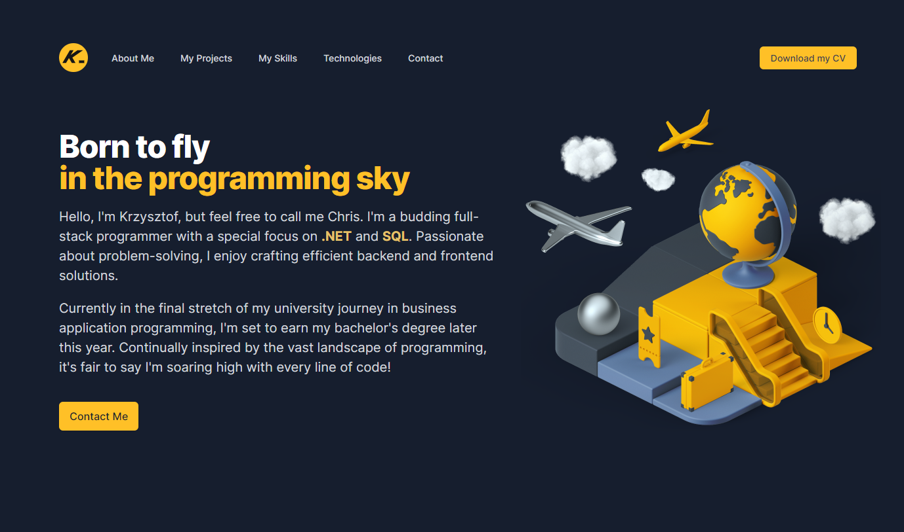

    <h1>Calculator With Themes</h1>
    <h3>
        <a href="https://chrisonoo.github.io/CalculatorWithThemes/">
            Live demo
        </a>
         | 
        <a href="https://github.com/chrisonoo/CalculatorWithThemes">
            GitHub
        </a>
    </h3>
    
A simple calculator with three color themes

    
<b>Status:</b> Project completed

     
    
Technologies and tools:

    

        
        
        
        
        
        
        
    

 

## Description

A basic calculator implementing four mathematical functions with three color themes, allowing for multiple operations until pressing equals.

Features and implementations include:

1. Performs addition, subtraction, multiplication, and division.
2. Operations on both positive and negative numbers.
3. Handling of divide by zero errors.
4. Restriction on input to a maximum of 13 characters, including numbers, periods, and the minus sign.
5. Conversion of results exceeding 13 characters into exponent notation.
6. Inclusion of a toggle button to switch between positive and negative signs.

## Desktop

## Mobile

## About Me

Hello, I'm Krzysztof, but feel free to call me Chris. I'm a budding full-stack programmer with a special focus on **.NET** and **SQL**. Passionate about problem-solving, I enjoy crafting efficient **backend** and **frontend** solutions.

As an emerging software developer, I'm keen to apply my knowledge and skills in a professional setting. I'm excited to bring my life and professional experience, providing a unique perspective to software development tasks. Eager to commence my journey in the industry, I am **actively seeking employment opportunities** where I can continue to grow and create.

Check out my [Portfolio](https://onoo.no/portfolio) or connect with me on [LinkedIn](https://www.linkedin.com/in/k-p-z/).

[
 
](https://onoo.no/portfolio)

